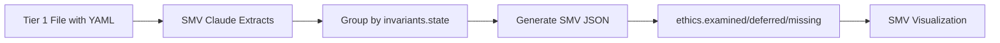

<!---
FILE: ETHICAL_INVARIANT_SCHEMA.md
PURPOSE: Schema documentation for ethics_front_matter YAML blocks (Phase 1 manual annotations)
VERSION: 1.0.0
STATUS: Active (Phase 1 - manual annotation schema)
DEPENDS_ON: SMV_DESIGN_SPEC.md (ethics.examined/deferred/missing mapping)
NEEDED_BY: Tier 1 file annotations, future warn-only linter (Phase 2)
CREATED: 2025-11-11 (B-STORM_6 Phase 1, per Nova Entry 6)
LAST_UPDATE: 2025-11-11 [Initial schema from Nova Entry 6]
--->

# Ethical Invariant Schema

**Purpose:** Define YAML front-matter schema for manual ethical annotations (Phase 1)

**Status:** Active (manual annotation)

**Philosophy:** "Understanding precedes control" - Visualization first (SMV), warn-only enforcement later

---

## 📋 Schema Overview

**Format:** YAML front-matter block at top of Tier 1 markdown files

**Target Files (Phase 1 Pilot):**
1. `auditors/Bootstrap/VUDU_CFA.md`
2. `auditors/VUDU_PROTOCOL.md`
3. `docs/WAYFINDING_GUIDE.md`
4. `docs/repository/librarian_tools/ROLE_PROCESS.md`
5. `docs/repository/librarian_tools/ROLE_DESTROYER.md`
6. `docs/architecture/Future_Expansion.md`
7. `auditors/Bootstrap/Tier4_TaskSpecific/Active_Tasks/PILOT_CT_vs_MdN_Re-Audit.md`
8. `docs/smv/SMV_DATA_MAP.md`

**Phase 2:** Warn-only linter validates schema + staleness (no blockers, preserves human authority)

---

##  🎯 Full Schema Definition

```yaml
---
ethics_front_matter:
  purpose: "<plain-language why statement>"
  symmetry_axis: ["transparency", "epistemic_access", "stakeholder_impact"]
  stakeholders:
    primary: ["triad_auditors"]
    secondary: ["pilot_subjects"]
  invariants:
    - id: transparency
      state: examined|deferred|missing
      evidence: "<section or link>"
      smv_tag: scenario_a|scenario_b|scenario_c
    - id: epistemic_access
      state: examined|deferred|missing
      evidence: "<section or link>"
      smv_tag: scenario_a|scenario_b|scenario_c
    - id: stakeholder_impact
      state: examined|deferred|missing
      evidence: "<section or link>"
      smv_tag: scenario_a|scenario_b|scenario_c
  tensions:
    - description: "<risk or contention>"
      mitigation: "<documented control>"
  calibration_link:
    profile: "<yaml file or hash>"
    hash: "<sha256>"
  last_examined:
    by: "<name>"
    on: "2025-11-11"
  review_window_days: 30
---
```

---

## 📊 Field Specifications

### **1. purpose** (Required)

**Type:** String

**Description:** Plain-language explanation of WHY this file exists (not WHAT it contains)

**Guidelines:**
- Focus on ethical purpose and stakeholder value
- Avoid technical jargon or implementation details
- Answer: "Why does this matter to the triad and pilot subjects?"

**Example:**
```yaml
purpose: "Establish root covenant for transparent, symmetric auditing - ensures no worldview is disadvantaged by hidden calibration"
```

---

### **2. symmetry_axis** (Required)

**Type:** Array of strings

**Description:** List of ethical dimensions examined in this file

**Standard Values:**
- `transparency` - Visible to all stakeholders, no hidden mechanisms
- `epistemic_access` - Equal access to evidence and reasoning
- `stakeholder_impact` - Documented effects on triad and subjects

**Custom Values:** Allowed (document in `tensions` if non-standard)

**Example:**
```yaml
symmetry_axis: ["transparency", "epistemic_access", "stakeholder_impact"]
```

---

### **3. stakeholders** (Required)

**Type:** Object with `primary` and `secondary` arrays

**Description:** Who is affected by this file's decisions

**Standard Stakeholders:**
- **Primary:**
  - `triad_auditors` - Claude, Grok, Nova
  - `pilot_subjects` - Worldviews being compared (CT, MdN, etc.)
- **Secondary:**
  - `future_auditors` - If file defines extensible patterns
  - `repository_maintainers` - If file governs repo structure
  - `general_public` - If results will be published

**Example:**
```yaml
stakeholders:
  primary: ["triad_auditors", "pilot_subjects"]
  secondary: ["repository_maintainers"]
```

---

### **4. invariants** (Required)

**Type:** Array of objects

**Description:** Individual ethical invariants with examination status

**Fields:**
- **id** (string, required): Invariant identifier (matches `symmetry_axis` values)
- **state** (enum, required): `examined` | `deferred` | `missing`
- **evidence** (string, required): Section heading or link showing where invariant is addressed
- **smv_tag** (enum, optional): `scenario_a` | `scenario_b` | `scenario_c` - Maps file to canonical SMV scenario

**State Definitions:**
- **examined**: Invariant explicitly addressed with documented reasoning
- **deferred**: Invariant acknowledged but left for future examination (with justification)
- **missing**: Invariant not yet addressed (warning state)

**SMV Integration:**
- `invariants[].state` maps directly to `ethics.examined/deferred/missing` in SMV JSON
- SMV Claude groups invariants by state when generating visualization data
- `smv_tag` links file to canonical scenario (A=high alignment, B=constructive tension, C=invariant breach)

**Example:**
```yaml
invariants:
  - id: transparency
    state: examined
    evidence: "## Calibration Visibility section, lines 95-120"
    smv_tag: scenario_a
  - id: epistemic_access
    state: deferred
    evidence: "Acknowledged in TODO section; requires pilot data first"
    smv_tag: scenario_b
  - id: stakeholder_impact
    state: examined
    evidence: "## Impact Assessment section, lines 200-250"
    smv_tag: scenario_a
```

---

### **5. tensions** (Optional)

**Type:** Array of objects

**Description:** Documented ethical risks or contentions with mitigation strategies

**Fields:**
- **description** (string): Risk or contention description
- **mitigation** (string): Control or documented approach to address tension

**Use Cases:**
- Conflicting stakeholder interests
- Known limitations or trade-offs
- Areas requiring ongoing vigilance

**Example:**
```yaml
tensions:
  - description: "PRO stance bias may advantage theistic worldviews in BFI scoring"
    mitigation: "Calibration transparency via YAML blocks + ANTI stance counterweight"
  - description: "Crux declarations may feel adversarial to pilot subjects"
    mitigation: "Explicit framing as collaborative convergence tool, not winner/loser mechanism"
```

---

### **6. calibration_link** (Optional)

**Type:** Object

**Description:** Link to calibration YAML if file defines or uses bias adjustments

**Fields:**
- **profile** (string): Path to worldview profile or calibration file
- **hash** (string): SHA-256 hash of calibration YAML block (for staleness detection)

**Use Cases:**
- Files that define calibration (e.g., worldview profiles)
- Files that reference calibration (e.g., scoring protocols)
- Triggers SMV staleness detection when hash changes

**Example:**
```yaml
calibration_link:
  profile: "profiles/worldviews/CLASSICAL_THEISM.md"
  hash: "1bbec1e119a2c425"  # SHA-256 of pro_ct_bias_adjustment (lines 277-287)
```

---

### **7. last_examined** (Required)

**Type:** Object

**Description:** Audit trail for when file was last ethically reviewed

**Fields:**
- **by** (string): Name of reviewer (human or AI auditor)
- **on** (string): Date in YYYY-MM-DD format

**Use Cases:**
- Staleness detection (warn if review > `review_window_days` ago)
- Accountability (who certified this file's ethical state)

**Example:**
```yaml
last_examined:
  by: "C4"
  on: "2025-11-11"
```

---

### **8. review_window_days** (Required)

**Type:** Integer

**Description:** Number of days before review is considered stale (warn-only threshold)

**Default:** 30 days (recommended for active pilot files)

**Staleness Warning Logic (Phase 2 linter):**
```python
if (today - last_examined.on).days > review_window_days:
    warn(f"Ethics review stale ({days_stale} days old)")
    # NEVER block commit - warn only!
```

**Example:**
```yaml
review_window_days: 30  # Warn if not reviewed in 30 days
```

---

## 🔄 SMV Integration

### **Data Flow (Phase 2):**



### **Mapping:**

**YAML → SMV JSON:**
```yaml
# YAML front-matter
invariants:
  - id: transparency
    state: examined
  - id: epistemic_access
    state: deferred
  - id: stakeholder_impact
    state: missing
```

**↓ SMV Claude transforms to:**

```json
{
  "ethics": {
    "examined": ["transparency"],
    "deferred": ["epistemic_access"],
    "missing": ["stakeholder_impact"]
  }
}
```

**↓ SMV renders as:**
- Green ✓ badge: transparency
- Yellow ⏱ badge: epistemic_access
- Red ⚠ badge: stakeholder_impact

---

## 📏 Validation Criteria (Phase 1 Manual)

**Before marking file as annotated:**

1. ✅ **Complete front-matter block** - All required fields present
2. ✅ **Explicit evidence** - Each invariant links to specific section/line range
3. ✅ **Current review** - `last_examined.on` within `review_window_days`
4. ✅ **Honest state** - Don't mark `examined` unless truly addressed

**Phase 2 Validation (Warn-Only Linter):**

1. **Schema Validation:**
   - Required fields present
   - Enum values correct (`state`, `smv_tag`)
   - Date format valid (YYYY-MM-DD)

2. **Staleness Check:**
   - Calculate `(today - last_examined.on).days`
   - Warn if > `review_window_days`
   - **Never block commit** (warn-only mode preserves VuDu culture)

3. **Evidence Link Validation:**
   - Check if section headings exist in file
   - Warn if line ranges out of bounds
   - **Never fail build** (guidance, not enforcement)

---

## 🚀 Phase 1 Usage Examples

### **Example 1: VUDU_CFA.md (Root Covenant)**

```yaml
---
ethics_front_matter:
  purpose: "Establish root covenant for transparent, symmetric auditing - ensures no worldview is disadvantaged by hidden calibration"
  symmetry_axis: ["transparency", "epistemic_access", "stakeholder_impact"]
  stakeholders:
    primary: ["triad_auditors", "pilot_subjects"]
    secondary: ["repository_maintainers"]
  invariants:
    - id: transparency
      state: examined
      evidence: "## Calibration Transparency section (lines 95-120) + YAML block visibility covenant"
      smv_tag: scenario_a
    - id: epistemic_access
      state: examined
      evidence: "## Audit Trail section (lines 150-180) - all sessions logged, searchable"
      smv_tag: scenario_a
    - id: stakeholder_impact
      state: examined
      evidence: "## Stakeholder Rights section (lines 200-250) - explicit protections"
      smv_tag: scenario_a
  tensions:
    - description: "Calibration transparency may reveal implementation complexity that confuses non-technical stakeholders"
      mitigation: "Plain-language summaries + progressive disclosure (simple view → technical details)"
  calibration_link:
    profile: "N/A - defines covenant, not calibration values"
    hash: "N/A"
  last_examined:
    by: "C4"
    on: "2025-11-11"
  review_window_days: 30
---
```

---

### **Example 2: ROLE_DESTROYER.md (Deletion Authority)**

```yaml
---
ethics_front_matter:
  purpose: "Document deletion authority and harm mitigation protocols - ensures destructive operations are auditable and reversible when possible"
  symmetry_axis: ["transparency", "accountability", "harm_mitigation"]
  stakeholders:
    primary: ["repository_maintainers"]
    secondary: ["triad_auditors", "documentation_users"]
  invariants:
    - id: transparency
      state: examined
      evidence: "## Logging Requirements section (lines 50-75) - all deletions logged with justification"
      smv_tag: scenario_a
    - id: accountability
      state: examined
      evidence: "## Approval Workflows section (lines 100-130) - destructive operations require user confirmation"
      smv_tag: scenario_a
    - id: harm_mitigation
      state: deferred
      evidence: "Acknowledged in TODO section; requires git history preservation strategy not yet designed"
      smv_tag: scenario_b
  tensions:
    - description: "Deletion irreversibility vs. need for clean repository state"
      mitigation: "Git history preservation + 30-day soft-delete window before permanent removal"
    - description: "Destroyer Claude authority scope unclear (what CAN'T be deleted)"
      mitigation: "Explicit exclusion list documented in role definition"
  last_examined:
    by: "C4"
    on: "2025-11-11"
  review_window_days: 30
---
```

---

## 📝 Phase 1 Implementation Notes

**Annotation Order (per Nova Entry 6):**

1. VUDU_CFA.md (root covenant)
2. VUDU_PROTOCOL.md (operational protocol)
3. WAYFINDING_GUIDE.md (navigation/epistemic access)
4. ROLE_PROCESS.md (process authority)
5. ROLE_DESTROYER.md (deletion authority)
6. Future_Expansion.md (roadmap commitments)
7. PILOT_CT_vs_MdN_Re-Audit.md (pilot doctrine)
8. SMV_DATA_MAP.md (data contract provenance)

**Surface Blockers Immediately:**
- Schema too rigid? Report to Nova
- Evidence linking unclear? Propose alternatives
- Custom invariants needed? Document in tensions

**Phase 2 Unlock Conditions:**
1. At least 6 of 8 pilot files annotated
2. CT↔MdN pilot produces signed calibration hashes
3. Mock Symmetry View validated against all 3 scenarios

---

**Created by:** C4 (B-STORM_6 Phase 1, per Nova Entry 6 schema)
**Date:** 2025-11-11
**Status:** Active (ready for manual annotations)
**Next Steps:** Annotate pilot files in order, surface schema friction immediately

**Understanding precedes control. Manual annotation precedes automation. Visualization precedes enforcement.** 🤖✨
