<!---
FILE: README.md
PURPOSE: Documentation for SMV automation scripts (Phase 2 implementation placeholders)
VERSION: 1.0.0
STATUS: Placeholder (Phase 2 - awaiting implementation)
DEPENDS_ON: SMV_DATA_MAP.md, SMV_DESIGN_SPEC.md, ROLE_SMV_CLAUDE.md
NEEDED_BY: SMV Claude (automation), Doc Claude (Repo Health integration), Process Claude (VUDU handoff)
MOVES_WITH: /docs/smv/scripts/
CREATED: 2025-11-11 (B-STORM_6 SMV Claude infrastructure)
LAST_UPDATE: 2025-11-11 [Placeholder stubs - implementation deferred to Phase 2]
--->

# SMV Automation Scripts

**Purpose:** Automation for SMV data pipeline (freshness detection, data extraction, validation, export)

**Status:** Placeholder (Phase 2 implementation)

---

## 📜 Script Inventory

| Script | Purpose | Status | Estimated LOC |
|--------|---------|--------|---------------|
| `smv_freshness_check.py` | Detect stale SMV data (profile changes since last export) | ⏳ Stub | ~200 |
| `smv_refresh.sh` | Regenerate SMV JSON from profiles (manual trigger) | ⏳ Stub | ~100 |
| `smv_validate_schema.py` | Validate JSON against SMV_DESIGN_SPEC.md schema v1.1+ | ⏳ Stub | ~150 |
| `smv_export_session.py` | Export VUDU session data → SMV JSON (Process Claude handoff) | ⏳ Stub | ~300 |
| `smv_calculate_hash.py` | Calculate SHA-256 hash of calibration YAML blocks | ⏳ Stub | ~50 |

**Total:** ~800 LOC (Python + Bash)

---

## 1. smv_freshness_check.py

**Purpose:** Detect which SMV comparisons are stale and need regeneration

**Usage:**
```bash
python docs/smv/scripts/smv_freshness_check.py

# Output (example):
# SMV Freshness Report (2025-11-12 14:45:00)
# ==========================================
# Stale Comparisons: 2
#
# 1. CT_vs_MdN.json
#    Reason: CLASSICAL_THEISM.md modified
#    Profile Modified: 2025-11-12 15:00:00
#    SMV Last Updated: 2025-11-12 14:45:00
#    Action: Run smv_refresh.sh CT_vs_MdN
#
# 2. CT_vs_ProcessTheology.json
#    Reason: Calibration hash mismatch (pro_ct)
#    Stored Hash: 1bbec1e119a2c425
#    Current Hash: 2acf3f220b3d5536
#    Action: Run smv_refresh.sh CT_vs_ProcessTheology
#
# Fresh Comparisons: 0
# Total Coverage: 2/66 (3%)
```

**Logic:**
1. List all `live_data/*.json` files
2. For each file, read `_meta.generated` timestamp
3. Check `_meta.source_files` for profile paths
4. Compare profile modification timestamps via `git log`
5. Verify calibration hashes (stored vs current)
6. Report stale files + reason + action needed

**Integration:** Doc Claude calls this during Repo Health scan, reports results in dashboard

**Implementation:** Phase 2 (post-pilot)

---

## 2. smv_refresh.sh

**Purpose:** Regenerate SMV JSON files from profiles (manual or automated trigger)

**Usage:**
```bash
# Regenerate all comparisons
./docs/smv/scripts/smv_refresh.sh

# Regenerate specific comparison
./docs/smv/scripts/smv_refresh.sh CT_vs_MdN

# Regenerate specific worldview's comparisons (all pairings involving CT)
./docs/smv/scripts/smv_refresh.sh --worldview CT
```

**Logic:**
1. Parse comparison pair (CT_vs_MdN) or worldview (CT)
2. Read profile files (CLASSICAL_THEISM.md, METHODOLOGICAL_NATURALISM.md)
3. Extract calibration YAML (lines 277-287 for PRO, 317+ for ANTI)
4. Calculate SHA-256 hashes
5. Read comparison file (CT_vs_MdN.yaml) for metadata
6. Merge profile data + VUDU tick data (if available)
7. Validate against SMV schema v1.1
8. Write to `live_data/CT_vs_MdN.json` with provenance metadata
9. Hand off to Logger Claude for session documentation

**Dependencies:**
- `smv_calculate_hash.py` (hash generation)
- `smv_validate_schema.py` (validation before export)
- `smv_export_session.py` (if VUDU data available)

**Implementation:** Phase 2 (post-pilot)

---

## 3. smv_validate_schema.py

**Purpose:** Validate SMV JSON against schema v1.1+ before export

**Usage:**
```bash
python docs/smv/scripts/smv_validate_schema.py live_data/CT_vs_MdN.json

# Output (success):
# ✅ CT_vs_MdN.json validated against SMV schema v1.1.0
# No errors found

# Output (failure):
# ❌ CT_vs_MdN.json FAILED validation
# Error 1: Missing required field 'comparison_type' (line 5)
# Error 2: Invalid crux.status value 'escalated' (line 120, expected: none|potential|declared|resolved)
```

**Logic:**
1. Load SMV_DESIGN_SPEC.md JSON schema definition
2. Parse input JSON file
3. Validate using `jsonschema` library (Python)
4. Report errors with field paths + expected vs actual
5. Exit code 0 (success) or 1 (failure)

**Integration:** Called by `smv_refresh.sh` before writing to `live_data/`

**Implementation:** Phase 2 (post-pilot)

---

## 4. smv_export_session.py

**Purpose:** Export VUDU session data → SMV JSON (Process Claude handoff integration)

**Usage:**
```bash
python docs/smv/scripts/smv_export_session.py CT_vs_MdN_VUDU_20251112

# Input: auditors/VUDU_logs/CT_vs_MdN_VUDU_20251112.json (Process Claude export)
# Output: docs/smv/live_data/CT_vs_MdN.json (SMV visualization-ready)
```

**Logic:**
1. Read VUDU log file (`auditors/VUDU_logs/{session_id}.json`)
2. Extract tick metadata (timestamp, sequence, confidence, tension, volume)
3. Read profile files for calibration YAML
4. Calculate calibration hashes
5. Merge VUDU ticks + profile calibration → SMV format
6. Validate against schema v1.1
7. Write to `live_data/{pair}.json` with provenance metadata
8. Report to Doc Claude + hand off to Logger Claude

**Dependencies:**
- Process Claude export format (VUDU log JSON structure)
- SMV_DATA_MAP.md extraction logic
- `smv_calculate_hash.py`, `smv_validate_schema.py`

**Implementation:** Phase 2 (after CT↔MdN pilot establishes VUDU export format)

---

## 5. smv_calculate_hash.py

**Purpose:** Calculate SHA-256 hash of calibration YAML blocks (for staleness detection)

**Usage:**
```bash
python docs/smv/scripts/smv_calculate_hash.py profiles/worldviews/CLASSICAL_THEISM.md pro_ct

# Output:
# Calibration YAML block (lines 277-287):
# pro_ct_bias_adjustment:
#   axiom_confidence: 0.85
#   ...
#
# SHA-256 Hash (full): 1bbec1e119a2c4256f8b3e9d0a7c4f5e2d1a9b8c7f6e5d4c3b2a1f0e9d8c7b6a5
# SHA-256 Hash (short): 1bbec1e119a2c425
```

**Logic:**
1. Parse worldview profile markdown file
2. Extract YAML block (pro_{abbreviation}_bias_adjustment or anti_{abbreviation}_bias_adjustment)
3. Calculate SHA-256 hash of YAML string
4. Return full hash (64 chars) + short hash (16 chars for display)

**Integration:** Called by `smv_refresh.sh` and `smv_export_session.py`

**Implementation:** Phase 2 (post-pilot)

---

## 🔄 Workflow Integration

### **Doc Claude Repo Health Scan**

```mermaid
graph LR
    A[Doc Claude: Repo Health Scan] --> B[Call smv_freshness_check.py]
    B --> C{Stale Data?}
    C -->|Yes| D[Report to Dashboard: ⚠️ Stale]
    C -->|No| E[Report to Dashboard: ✅ Fresh]
    D --> F[User decides: run smv_refresh.sh?]
```



### **Process Claude VUDU Handoff (Phase 2)**


### **Manual User Refresh**


---

## 🚀 Implementation Timeline

**Phase 2 (Post-CT↔MdN Pilot):**
1. Implement `smv_calculate_hash.py` (50 LOC, ~1 hour)
2. Implement `smv_validate_schema.py` (150 LOC, ~2 hours)
3. Implement `smv_freshness_check.py` (200 LOC, ~3 hours)
4. Implement `smv_refresh.sh` (100 LOC, ~2 hours)
5. Integrate with Doc Claude Repo Health (1 hour)
6. Test with CT_vs_MdN pilot data (2 hours)

**Total:** ~11 hours implementation + testing

**Phase 3 (VUDU Integration):**
1. Define Process Claude VUDU export format (collaborate with Process Claude)
2. Implement `smv_export_session.py` (300 LOC, ~4 hours)
3. Test with real VUDU session data
4. Establish handoff protocol (Process → SMV → Logger)

**Total:** ~6 hours implementation + testing

---

## 📚 Dependencies

**Python Libraries:**
- `jsonschema` - JSON schema validation
- `ruamel.yaml` - YAML parsing (preserves comments)
- `hashlib` - SHA-256 hash calculation (built-in)
- `pathlib` - File path operations (built-in)
- `argparse` - CLI argument parsing (built-in)

**Bash Utilities:**
- `jq` - JSON parsing in shell scripts
- `git` - File modification timestamps, diff detection

---

## 📝 Next Steps

**Phase 2 Trigger:** CT↔MdN pilot completes, Process Claude exports first VUDU session

**Implementation Order:**
1. `smv_calculate_hash.py` (foundational utility)
2. `smv_validate_schema.py` (validation before export)
3. `smv_freshness_check.py` (staleness detection)
4. `smv_refresh.sh` (manual regeneration workflow)
5. `smv_export_session.py` (VUDU integration - after pilot data available)

**User Involvement:** None required until Phase 2 (scripts will be implemented by SMV Claude, reviewed by Trinity)

---

**Created by:** SMV Claude (B-STORM_6 infrastructure setup)
**Date:** 2025-11-11
**Status:** Placeholder stubs (Phase 2 implementation)
**Next Steps:** Await CT↔MdN pilot completion → implement automation scripts

**Automation serves reflection. Scripts serve SMV Claude. SMV Claude serves visualization.** 🤖✨
